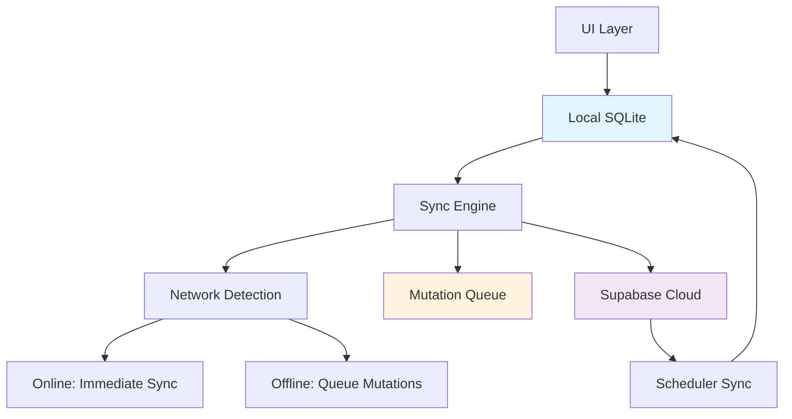

# Sistema de Sincronización - Myosin

## 📋 Descripción General

El sistema de sincronización de Myosin implementa una arquitectura **local-first** robusta que garantiza una experiencia de usuario fluida independientemente del estado de la conexión a internet. El sistema se basa en tres pilares fundamentales que trabajan en conjunto para mantener la consistencia de datos.

## 🏗️ Arquitectura del Sistema



## 🔄 Pilar 1: Mutations Sync con Cola Offline

### **Arquitectura de Mutations**

El sistema de mutations permite realizar cambios de datos con sincronización automática a la nube, implementando una cola inteligente para escenarios offline.

#### **Flujo de Mutations**

```typescript
// 1. Operación Local-First
const result = await localRepository.create(data);

// 2. UI Update Inmediato
setLocalState(result);

// 3. Background Sync
sync("ENTITY_CREATE", payload);
```

#### **Engine de Sincronización**

```typescript
// shared/sync/sync-engine.ts
export const useSyncEngine = () => {
  const isOnline = useNetwork();

  const sync = async (
    code: MutationCode,
    payload: any
  ): Promise<SyncResult> => {
    if (!isOnline) {
      // 🚧 TODO: Implementar cola offline
      return await queueMutation(code, payload);
    }

    // Sync inmediato si hay conexión
    return await syncToSupabase(code, payload);
  };
};
```

### **Tipos de Mutations Implementadas**

#### **1. Rutinas**

```typescript
// Crear rutina
sync("ROUTINE_CREATE", {
  session: routineData,
  blocks: blocksData,
  exercises: exercisesData,
  sets: setsData,
});

// Actualizar rutina
sync("ROUTINE_UPDATE", {
  routineId: "uuid",
  data: updatedRoutineData,
});

// Eliminar rutina
sync("ROUTINE_DELETE", { id: "uuid" });

// Limpiar días de entrenamiento
sync("ROUTINE_CLEAR_TRAINING_DAYS", { routineId: "uuid" });
```

#### **2. Carpetas**

```typescript
// CRUD completo de carpetas
sync("FOLDER_CREATE", folderData);
sync("FOLDER_UPDATE", { id: "uuid", data: updateData });
sync("FOLDER_DELETE", { id: "uuid" });
sync("FOLDER_REORDER", { orderedIds: ["uuid1", "uuid2"] });
```

#### **3. Sesiones de Entrenamiento**

```typescript
// Completar workout
sync("WORKOUT_COMPLETE", {
  session: sessionData,
  blocks: blocksSnapshot,
  exercises: exercisesSnapshot,
  sets: completedSetsData,
});
```

#### **4. Records Personales (PRs)**

```typescript
// Nuevo PR actual
sync("PR_CREATE", {
  user_id: "uuid",
  exercise_id: "uuid",
  best_weight: 100,
  best_reps: 10,
  estimated_1rm: 133.33,
});

// Historial de PR
sync("PR_UPDATE", {
  user_id: "uuid",
  exercise_id: "uuid",
  workout_session_id: "uuid",
  weight: 95,
  reps: 12,
});
```

#### **5. Preferencias de Usuario**

```typescript
// Configuración inicial
sync("USER_PREFERENCES_CREATE", {
  userId: "uuid",
  data: defaultPreferences,
});

// Actualizar preferencias
sync("USER_PREFERENCES_UPDATE", {
  userId: "uuid",
  data: { weight_unit: "kg", show_rpe: true },
});
```

### **Dictionary de Mutations**

```typescript
// shared/sync/dictionary/sync-dictionary.ts
export const supabaseSyncDictionary: Record<MutationCode, Function> = {
  // Rutinas
  ROUTINE_CREATE: (payload) => routinesRepo.createRoutineWithData(payload),
  ROUTINE_UPDATE: (payload) =>
    routinesRepo.updateRoutineWithData(payload.routineId, payload.data),
  ROUTINE_DELETE: (payload) => routinesRepo.deleteRoutineById(payload.id),

  // Carpetas
  FOLDER_CREATE: (payload) => foldersRepo.create(payload),
  FOLDER_UPDATE: (payload) => foldersRepo.update(payload.id, payload.data),
  FOLDER_DELETE: (payload) => foldersRepo.delete(payload.id),

  // Workouts
  WORKOUT_COMPLETE: (payload) =>
    workoutRepo.createWorkoutSessionWithData(payload),

  // PRs
  PR_CREATE: (payload) => prRepo.upsertCurrentPR(payload),
  PR_UPDATE: (payload) => prRepo.insertPRHistory(payload),

  // User Preferences
  USER_PREFERENCES_CREATE: (payload) =>
    userRepo.createUserPreferences(payload.userId, payload.data),
  USER_PREFERENCES_UPDATE: (payload) =>
    userRepo.updateUserPreferences(payload.userId, payload.data),
};
```

### **Sistema de Cola Offline (Pendiente de Implementación)**

```typescript
// 🚧 Implementación futura
interface QueuedMutation {
  id: string;
  code: MutationCode;
  payload: any;
  timestamp: number;
  retries: number;
  status: "pending" | "failed" | "completed";
}

class MutationQueue {
  private queue: QueuedMutation[] = [];

  async queueMutation(code: MutationCode, payload: any) {
    const mutation: QueuedMutation = {
      id: generateUUID(),
      code,
      payload,
      timestamp: Date.now(),
      retries: 0,
      status: "pending",
    };

    // Guardar en AsyncStorage
    await this.persistQueue();

    // Retry cuando vuelva la conexión
    this.onNetworkReconnect();
  }

  async processQueue() {
    const pendingMutations = this.queue.filter((m) => m.status === "pending");

    for (const mutation of pendingMutations) {
      try {
        await syncToSupabase(mutation.code, mutation.payload);
        mutation.status = "completed";
      } catch (error) {
        mutation.retries++;
        if (mutation.retries >= 3) {
          mutation.status = "failed";
        }
      }
    }

    await this.persistQueue();
  }
}
```

## 📥 Pilar 2: Get Combinado (Local First + Supabase)

### **Estrategia de Lectura Híbrida**

El sistema de lectura combina datos locales con datos de Supabase para ofrecer la información más completa y actualizada posible.

#### **Patrón de Implementación**

```typescript
// Ejemplo: Hook de datos de rutinas
export const useRoutinesData = (userId: string) => {
  return useQuery({
    queryKey: ["routines", userId],
    queryFn: async () => {
      // 1. Obtener datos locales (cache inmediato)
      const localRoutines = await localRoutinesRepository.getByUserId(userId);

      // 2. Si hay conexión, obtener datos de Supabase
      if (isOnline) {
        try {
          const supabaseRoutines = await supabaseRoutinesRepository.getByUserId(
            userId
          );

          // 3. Merge inteligente de datos
          const mergedData = mergeRoutineData(localRoutines, supabaseRoutines);

          // 4. Actualizar cache local con datos frescos
          await syncLocalCache(mergedData);

          return mergedData;
        } catch (error) {
          // Fallback a datos locales si falla Supabase
          console.warn("Supabase fetch failed, using local data", error);
          return localRoutines;
        }
      }

      // 5. Offline: solo datos locales
      return localRoutines;
    },
    staleTime: 5 * 60 * 1000, // 5 minutos
    cacheTime: 10 * 60 * 1000, // 10 minutos
  });
};
```

#### **Merge de Datos Inteligente**

```typescript
function mergeRoutineData(local: Routine[], remote: Routine[]): Routine[] {
  const mergedMap = new Map<string, Routine>();

  // 1. Agregar datos locales
  local.forEach((routine) => {
    mergedMap.set(routine.id, routine);
  });

  // 2. Merge con datos remotos (más recientes ganan)
  remote.forEach((remoteRoutine) => {
    const localRoutine = mergedMap.get(remoteRoutine.id);

    if (!localRoutine) {
      // Rutina nueva desde Supabase
      mergedMap.set(remoteRoutine.id, remoteRoutine);
    } else {
      // Usar el más reciente basado en updated_at
      const localTime = new Date(localRoutine.updated_at).getTime();
      const remoteTime = new Date(remoteRoutine.updated_at).getTime();

      if (remoteTime > localTime) {
        mergedMap.set(remoteRoutine.id, remoteRoutine);
      }
    }
  });

  return Array.from(mergedMap.values());
}
```

### **Casos de Uso del Get Combinado**

#### **1. Dashboard Analytics**

```typescript
export const useAnalyticsData = (userId: string) => {
  return useQuery({
    queryKey: ["analytics", userId],
    queryFn: async () => {
      const [localSessions, localPRs, localRoutines] = await Promise.all([
        workoutSessionsRepository.getRecentSessions(10),
        prRepository.getTopPRs(userId, 10),
        routinesRepository.getActiveRoutines(userId),
      ]);

      // Si online, enriquecer con datos de Supabase
      if (isOnline) {
        const [remoteSessions, remotePRs, remoteRoutines] = await Promise.all([
          supabaseWorkoutRepo.getRecentSessions(userId, 10),
          supabasePRRepo.getTopPRs(userId, 10),
          supabaseRoutinesRepo.getActiveRoutines(userId),
        ]);

        return {
          recentSessions: mergeSessions(localSessions, remoteSessions),
          topPRs: mergePRs(localPRs, remotePRs),
          activeRoutines: mergeRoutines(localRoutines, remoteRoutines),
        };
      }

      return {
        recentSessions: localSessions,
        topPRs: localPRs,
        activeRoutines: localRoutines,
      };
    },
  });
};
```

#### **2. Lista de Rutinas con Sincronización**

```typescript
export const useWorkoutsList = (userId: string) => {
  const { data, isLoading, error } = useQuery({
    queryKey: ["workouts", userId],
    queryFn: () => getWorkoutsWithSync(userId),
    staleTime: 2 * 60 * 1000, // 2 minutos
  });

  return {
    routines: data?.routines || [],
    folders: data?.folders || [],
    isLoading,
    error,
  };
};

async function getWorkoutsWithSync(userId: string) {
  // Local first
  const [localRoutines, localFolders] = await Promise.all([
    routinesRepository.getByUserId(userId),
    foldersRepository.getByUserId(userId),
  ]);

  if (isOnline) {
    // Enriquecer con datos remotos
    const [remoteRoutines, remoteFolders] = await Promise.all([
      supabaseRoutinesRepo.getByUserId(userId),
      supabaseFoldersRepo.getByUserId(userId),
    ]);

    return {
      routines: mergeRoutines(localRoutines, remoteRoutines),
      folders: mergeFolders(localFolders, remoteFolders),
    };
  }

  return {
    routines: localRoutines,
    folders: localFolders,
  };
}
```

## ⏰ Pilar 3: Scheduler de Sincronización Automática

### **Sistema de Sincronización Programada**

El scheduler mantiene los datos locales actualizados verificando cambios en Supabase de forma automática y eficiente.

#### **Implementación del Scheduler (Pendiente)**

```typescript
// 🚧 Implementación futura
class SyncScheduler {
  private intervals: Map<string, NodeJS.Timeout> = new Map();
  private lastSyncTimestamps: Map<string, number> = new Map();

  constructor(private syncEngine: SyncEngine) {}

  // Programar sync automático para una entidad
  scheduleEntitySync(entity: string, intervalMs: number = 5 * 60 * 1000) {
    const existingInterval = this.intervals.get(entity);
    if (existingInterval) {
      clearInterval(existingInterval);
    }

    const interval = setInterval(async () => {
      await this.syncEntity(entity);
    }, intervalMs);

    this.intervals.set(entity, interval);
  }

  private async syncEntity(entity: string) {
    if (!navigator.onLine) return;

    const lastSync = this.lastSyncTimestamps.get(entity) || 0;
    const now = Date.now();

    try {
      switch (entity) {
        case "routines":
          await this.syncRoutines(lastSync);
          break;
        case "workouts":
          await this.syncWorkouts(lastSync);
          break;
        case "prs":
          await this.syncPRs(lastSync);
          break;
      }

      this.lastSyncTimestamps.set(entity, now);
    } catch (error) {
      console.error(`Scheduled sync failed for ${entity}:`, error);
    }
  }

  private async syncRoutines(since: number) {
    // Obtener rutinas modificadas desde el último sync
    const modifiedRoutines = await supabaseRoutinesRepo.getModifiedSince(since);

    if (modifiedRoutines.length > 0) {
      // Actualizar cache local
      await Promise.all(
        modifiedRoutines.map((routine) => localRoutinesRepo.upsert(routine))
      );

      // Invalidar queries de React Query
      queryClient.invalidateQueries(["routines"]);

      console.log(`✅ Synced ${modifiedRoutines.length} routines`);
    }
  }

  private async syncWorkouts(since: number) {
    const modifiedSessions = await supabaseWorkoutRepo.getModifiedSince(since);

    if (modifiedSessions.length > 0) {
      await Promise.all(
        modifiedSessions.map((session) => localWorkoutRepo.upsert(session))
      );

      queryClient.invalidateQueries(["workouts"]);
      queryClient.invalidateQueries(["analytics"]);

      console.log(`✅ Synced ${modifiedSessions.length} workout sessions`);
    }
  }

  private async syncPRs(since: number) {
    const [modifiedHistory, modifiedCurrent] = await Promise.all([
      supabasePRRepo.getHistoryModifiedSince(since),
      supabasePRRepo.getCurrentModifiedSince(since),
    ]);

    if (modifiedHistory.length > 0 || modifiedCurrent.length > 0) {
      await Promise.all([
        ...modifiedHistory.map((pr) => localPRRepo.upsertHistory(pr)),
        ...modifiedCurrent.map((pr) => localPRRepo.upsertCurrent(pr)),
      ]);

      queryClient.invalidateQueries(["prs"]);
      queryClient.invalidateQueries(["analytics"]);

      console.log(
        `✅ Synced ${modifiedHistory.length} PR history, ${modifiedCurrent.length} current PRs`
      );
    }
  }
}
```

#### **Configuración del Scheduler**

```typescript
// Inicialización en el app root
export function AppSyncProvider({ children }: { children: React.ReactNode }) {
  const syncEngine = useSyncEngine();
  const scheduler = useMemo(() => new SyncScheduler(syncEngine), [syncEngine]);

  useEffect(() => {
    // Configurar intervalos de sync
    scheduler.scheduleEntitySync("routines", 5 * 60 * 1000); // 5 min
    scheduler.scheduleEntitySync("workouts", 10 * 60 * 1000); // 10 min
    scheduler.scheduleEntitySync("prs", 15 * 60 * 1000); // 15 min

    return () => {
      scheduler.cleanup();
    };
  }, [scheduler]);

  return <>{children}</>;
}
```

### **Optimizaciones del Scheduler**

#### **1. Sync Incremental con Timestamps**

```typescript
// Obtener solo datos modificados desde la última sincronización
const getModifiedSince = async (tableName: string, timestamp: number) => {
  const { data, error } = await supabase
    .from(tableName)
    .select("*")
    .gte("updated_at", new Date(timestamp).toISOString())
    .order("updated_at", { ascending: true });

  if (error) throw error;
  return data;
};
```

#### **2. Sync Condicional basado en App State**

```typescript
import { AppState } from "react-native";

class SmartSyncScheduler extends SyncScheduler {
  constructor(syncEngine: SyncEngine) {
    super(syncEngine);

    // Solo sincronizar cuando la app está activa
    AppState.addEventListener("change", this.handleAppStateChange);
  }

  private handleAppStateChange = (nextAppState: string) => {
    if (nextAppState === "active") {
      // App volvió a primer plano - sync inmediato
      this.syncAllEntities();
    } else if (nextAppState === "background") {
      // App en background - pausar sync programado
      this.pauseScheduledSync();
    }
  };
}
```

#### **3. Sync Prioritizado**

```typescript
// Prioridades de sincronización
const SYNC_PRIORITIES = {
  user_preferences: 1, // Más importante
  routines: 2,
  workouts: 3,
  prs: 4,
  analytics: 5, // Menos importante
} as const;

class PrioritizedSyncScheduler extends SyncScheduler {
  async syncByPriority() {
    const entities = Object.entries(SYNC_PRIORITIES)
      .sort(([, a], [, b]) => a - b)
      .map(([entity]) => entity);

    for (const entity of entities) {
      await this.syncEntity(entity);

      // Pequeña pausa entre syncs para no saturar
      await new Promise((resolve) => setTimeout(resolve, 100));
    }
  }
}
```

## 🔧 Configuración y Uso

### **Implementación en Hooks**

```typescript
// Hook genérico para data con sync
export function useDataWithSync<T>(
  queryKey: QueryKey,
  localFetcher: () => Promise<T>,
  remoteFetcher?: () => Promise<T>,
  syncOptions?: {
    staleTime?: number;
    cacheTime?: number;
    enableScheduler?: boolean;
  }
) {
  const { isOnline } = useNetwork();

  return useQuery({
    queryKey,
    queryFn: async () => {
      const localData = await localFetcher();

      if (isOnline && remoteFetcher) {
        try {
          const remoteData = await remoteFetcher();
          return mergeData(localData, remoteData);
        } catch (error) {
          console.warn("Remote fetch failed, using local data", error);
          return localData;
        }
      }

      return localData;
    },
    staleTime: syncOptions?.staleTime || 5 * 60 * 1000,
    cacheTime: syncOptions?.cacheTime || 10 * 60 * 1000,
  });
}
```

### **Ejemplo de Uso Completo**

```typescript
// En un componente de rutinas
export const RoutinesFeature: React.FC = () => {
  const { user } = useAuth();
  const { sync } = useSyncEngine();

  // 1. Get combinado con datos locales + remotos
  const { data: routines, isLoading } = useDataWithSync(
    ["routines", user?.id],
    () => localRoutinesRepo.getByUserId(user?.id),
    () => supabaseRoutinesRepo.getByUserId(user?.id)
  );

  // 2. Mutation con sync automático
  const handleCreateRoutine = async (routineData: CreateRoutineData) => {
    // Local first
    const savedRoutine = await localRoutinesRepo.create(routineData);

    // UI update inmediato
    queryClient.setQueryData(["routines", user?.id], (prev) => [
      ...prev,
      savedRoutine,
    ]);

    // Background sync
    sync("ROUTINE_CREATE", routineData);
  };

  return (
    <RoutinesList
      routines={routines}
      onCreateRoutine={handleCreateRoutine}
      isLoading={isLoading}
    />
  );
};
```

## 📊 Estado de Implementación

### **✅ Implementado**

- ✅ Sistema de mutations básico
- ✅ Sync engine con detección de red
- ✅ Mutations para rutinas, carpetas, workouts, PRs, user preferences
- ✅ Get combinado en analytics y listas
- ✅ Repositorios base para Supabase
- ✅ RPC functions para operaciones complejas

### **🚧 En Desarrollo**

- 🚧 Cola de mutations offline
- 🚧 Scheduler automático
- 🚧 Sync incremental con timestamps
- 🚧 Resolución de conflictos

### **📋 Planificado**

- 📋 Sync bidireccional inteligente
- 📋 Compresión de datos para sync
- 📋 Métricas de sincronización
- 📋 Rollback automático en errores

## 🎯 Beneficios del Sistema

### **Para Usuarios**

- ✅ **Experiencia fluida**: Sin interrupciones por problemas de red
- ✅ **Datos siempre disponibles**: Funcionalidad completa offline
- ✅ **Sincronización transparente**: Los datos se mantienen actualizados automáticamente
- ✅ **Rendimiento óptimo**: Respuesta inmediata de la UI

### **Para Desarrolladores**

- ✅ **Arquitectura escalable**: Fácil agregar nuevas entidades
- ✅ **Debugging simple**: Logs claros del estado de sync
- ✅ **Patterns consistentes**: Mismo flujo para todas las mutations
- ✅ **Flexibilidad**: Fácil configurar diferentes estrategias de sync

---

Este sistema de sincronización está diseñado para evolucionar y adaptarse a las necesidades futuras de Myosin, manteniendo siempre la premisa de **local-first** para garantizar la mejor experiencia de usuario posible.
